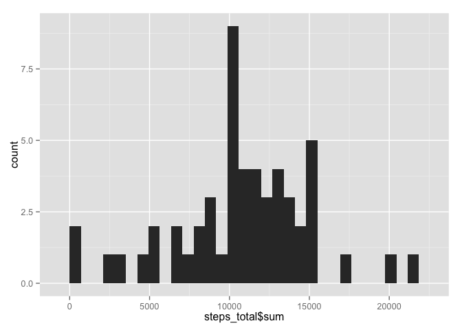
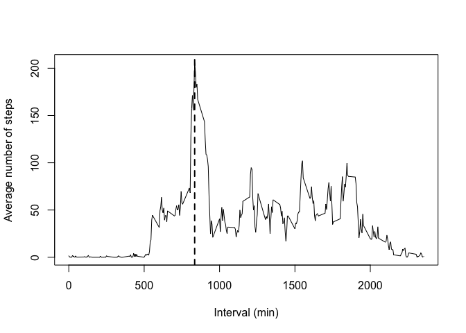
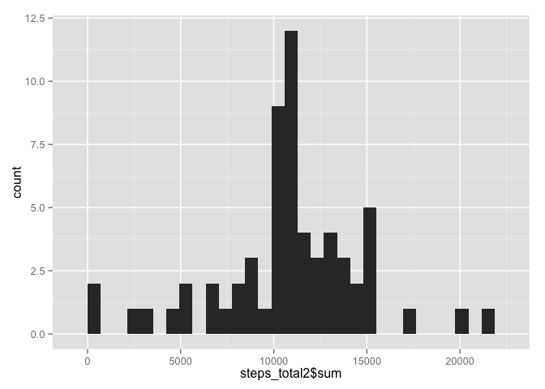
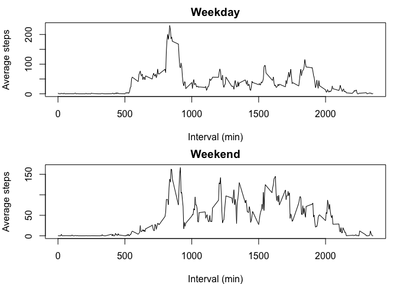

# Reproducible Research: Peer Assessment 1


## Loading and preprocessing the data
Include R packages used in R code and load the data:

```r
library(dplyr)
```

```
## 
## Attaching package: 'dplyr'
## 
## The following objects are masked from 'package:stats':
## 
##     filter, lag
## 
## The following objects are masked from 'package:base':
## 
##     intersect, setdiff, setequal, union
```

```r
library(ggplot2)
setwd("/Users/xiao/RepData_PeerAssessment1")
Loaded<- read.csv("activity.csv")
```


## What is mean total number of steps taken per day?
Q1-1 Make a histogram of the total number of steps taken each day

```r
Grouped<- group_by(Loaded, date)
steps_total<- summarize(Grouped, sum(steps))
ggplot(data=steps_total, aes(steps_total$sum)) + geom_histogram()
```

```
## stat_bin: binwidth defaulted to range/30. Use 'binwidth = x' to adjust this.
```

 

```r
dev.print(pdf, 'plot1.pdf')
```

```
## quartz_off_screen 
##                 2
```
   
Q1-2 Calculate and report the mean and median total number of steps taken per day. Results show Median = 10760 steps, Mean = 10770 steps

```r
summary(steps_total$sum)
```

```
##    Min. 1st Qu.  Median    Mean 3rd Qu.    Max.    NA's 
##      41    8841   10760   10770   13290   21190       8
```


## What is the average daily activity pattern?

Q2-1. What is the average daily activity pattern?
      
Q2-2. Which 5-minute interval, on average across all the days in the dataset, contains the maximum number of steps?    
Ressults show the interval of 835 - 840 contains the maximum number of steps


```r
GroupedbyInterval<- group_by(Loaded, interval)
steps_ave<- summarize(GroupedbyInterval, m = mean(steps, na.rm = TRUE))
with(steps_ave, plot(interval,m,type = "l", xlab="Interval (min)",ylab="Average number of steps"))
abline(v=835,lwd=2,lty=2)
```

 

```r
dev.print(pdf, 'plot2.pdf')
```

```
## quartz_off_screen 
##                 2
```

## Imputing missing values

3-1 Results show there are 2304 missing values in variable "steps"

```r
sapply(Loaded, function(x) sum(is.na(x))) 
```

```
##    steps     date interval 
##     2304        0        0
```

Q3-2 to Q3-3 Filling in all of the missing values by mean of each 5-min interval
(there are days all NA in one day, so I decided not to fill in missing values by mean of the day)   
New dataset that is equal to the original dataset but with the missing data filled in is called "data" in the following R code

```r
Grouped_interval<- group_by(Loaded, interval)
steps_ave<- summarize(Grouped_interval, Mean_interval = mean(steps, na.rm = TRUE))
# add 3rd variable represents the mean steps of a certain interval
data<- merge(Loaded,steps_ave, by = "interval" )
# Replace NA by the mean value of the interval
for (i in 1:length(data$steps)){
    if (is.na(data$steps[i]) == "TRUE"){data$steps[i]<- data$Mean_interval[i] }
}
```
Q 3-4 Make a histogram of the total number of steps taken each day and Calculate and report the mean and median total number of steps taken per day.    
Results show mean (10770) and median (10770) total number of steps taken per day are slightly different then those (mean = 10770; median = 10760) excluding missing values. Imapct is negligible. 

```r
Grouped_date<- group_by(data, date)
steps_total2<- summarize(Grouped_date, sum(steps))
ggplot(data=steps_total, aes(steps_total2$sum)) + geom_histogram()
```

```
## stat_bin: binwidth defaulted to range/30. Use 'binwidth = x' to adjust this.
```

 

```r
summary(steps_total2$sum)
```

```
##    Min. 1st Qu.  Median    Mean 3rd Qu.    Max. 
##      41    9819   10770   10770   12810   21190
```

```r
dev.print(pdf, 'plot3.pdf')
```

```
## quartz_off_screen 
##                 2
```


## Are there differences in activity patterns between weekdays and weekends?

Q4-1 Create a new factor variable in the dataset with two levels -- "weekday" and "weekend" indicating whether a given date is a weekday or weekend day.

```r
data$date<-as.POSIXct(strptime(data$date, "%Y-%m-%d"))
# create a factor varaible of two levels: weekday and weekend
# asign each row to either level accordingly 
data<-mutate(data, weekday= weekdays(date))
for (i in 1:length(Loaded$date)){
    if (data$weekday[i] == "Saturday" | data$weekday[i] == "Sunday"){data$weekday[i]<-"Weekends"}
    else{data$weekday[i]<-"Weekdays"}
}
data$weekday<-as.factor(data$weekday)
```
Q4-2 Make a panel plot containing a time series plot (i.e. type = "l") of the 5-minute interval (x-axis) and the average number of steps taken, averaged across all weekday days or weekend days (y-axis).   
Results show in weekdays, average steps per 5-min interval peak at around the 750th  interval while in weekends, there is no obvious peak relatively speaking. 

```r
weekdayData<-data[which(data$weekday == "Weekdays"),]
weekendData<-data[which(data$weekday == "Weekends"),]
Grouped_weekday<- group_by(weekdayData, interval)
Grouped_weekend<- group_by(weekendData, interval)
WeekdayStepsAve<- summarize(Grouped_weekday, m2 = mean(steps, na.rm = TRUE))
WeekendStepsAve<- summarize(Grouped_weekend, m3 = mean(steps, na.rm = TRUE))

par(mfrow = c(2,1))
par(mfrow=c(2,1),mar=c(4,4,2,1))
plot(WeekdayStepsAve$interval, WeekdayStepsAve$m2,type="l",xlab="Interval (min)",ylab="Average steps",main ="Weekday")
plot(WeekendStepsAve$interval, WeekendStepsAve$m3,type="l",xlab="Interval (min)",ylab="Average steps", main = "Weekend")
```

 

```r
dev.print(pdf, 'plot4.pdf')
```

```
## quartz_off_screen 
##                 2
```

